# NetworkWalks_Cybersecurity_Week2
# Penetration Testing Report — Footprinting, OSINT & Network Scanning Phases
 

 
**W2-PM-FINAL | CYBERSECURITY | NETWORKWALKS ACADEMY**
 
| | |
|---|---|
| **Pentester Name** | Muhammad Ahsan|
| **Batch** | B083 \| NetworkWalks Cybersecurity Internship |
| **Date** | 18 September 2026 |
| **Modules Completed** | W2-PM1: Footprinting with Multiple Kali Tools W2-PM4: theHarvester-based Footprinting W2-PM5: Zenmap Network Scanning |
| **Client / Target** | 1. `networkwalks.com` (written permission secured) 2. My own local VirtualBox host-only LAN |
| **Permission Secured** | ✅ Yes |
| **Phases Covered** | Phase 1: Reconnaissance & Footprinting Phase 2: Scanning & Network Discovery Phase 3–5: In Progress |

--- 
📥 **[Download Full Report — PDF](./Networkwalks_Pentest_Report_W2.pdf)**

---
 
## ✅ Module Completion Status
 
| Category | Module | Description | Status |
|---|---|---|---|
| Elective | **W2-PM1** | Footprinting with multiple Kali tools (6 tools on `networkwalks.com`) | ✅ Done |
| Elective | W2-PM2 | GHDB-based Footprinting Attacks | ⬜ Not attempted |
| Elective | W2-PM3 | Maltego-based Footprinting Attacks | ⬜ Not attempted |
| Elective | **W2-PM4** | theHarvester-based Footprinting Attacks | ✅ Done |
| Essential | **W2-PM5** | Zenmap-based Network Scanning | ✅ Done |
| Essential | **W2-PM-FINAL** | Detailed report covering the modules chosen | ✅ Done |
 
> Only **one** elective was required — I completed **two** (W2-PM1 and W2-PM4) for broader hands-on exposure, plus both required essentials.
 
---
 
## 1. Liability Disclaimer
 
Everything in this report was carried out against systems I had explicit permission to test — `networkwalks.com`, where written authorization was already in place, and a local VirtualBox host-only network that I own and control. None of this was run against anything I didn't have the right to touch.
 
This document is written for education and internal learning purposes only. I'm not responsible for how anyone else chooses to use the information here, and neither is Networkwalks or my instructor — that responsibility sits with whoever takes the action. It's worth repeating something obvious but important: unauthorized access is illegal in most countries even if nothing gets damaged, and getting this wrong can mean criminal charges, fines, a lost job, or a record that follows you. None of that is worth it.
 
---
 
## 2. Introduction
 
This report covers Week 2 of my Cybersecurity & Ethical Hacking internship at Networkwalks. The internship structure offers a set of electives (at least one is required) plus two essential modules that everyone has to complete. I ended up covering two electives instead of just the minimum one — **W2-PM1** (footprinting with multiple Kali tools) and **W2-PM4** (theHarvester-based footprinting) — on top of the required **W2-PM5** (Zenmap network scanning). This document itself is **W2-PM-FINAL**, the write-up that ties everything together.
 
The idea behind all of these exercises is the same thing an actual attacker would do at the very start of an engagement: figure out as much as possible about a target before ever touching it directly, then start mapping out what's actually reachable on a network.
 
For W2-PM1, my target was `networkwalks.com`, worked through using six different Kali Linux tools — `whois`, `whatweb`, `nslookup`, `curl`, `wafw00f` and `dnsrecon`. For W2-PM4, I used `theHarvester` against `microsoft.com` to practice passive OSINT harvesting and see how the tool handles data sources that need paid API keys I don't have. For W2-PM5, I used Zenmap (the GUI front-end for Nmap) to sweep my own local network and see what showed up.
 
Below, each tool is laid out in the order it was actually run, with the exact command, what came back, a screenshot, and — right after each one — a short note on how that specific piece of information could realistically be used against the target if I were on the other side of the table.
 
---
 
## 3. Tools Used
 
Quick rundown of every tool that shows up in this report and what it actually does.
 
| Tool | What it's for |
|---|---|
| Kali Linux & Windows | The two operating systems worked from — Kali for the command-line recon tools, Windows for Zenmap and the local network scan |
| `whois` | Pulls domain registration details — who registered it, when, and which name servers are handling DNS |
| `whatweb` | Fingerprints the technology stack behind a website — CMS, plugins, server software, frameworks |
| `nslookup` | Resolves a domain name to its IP address |
| `curl -I` | Grabs the raw HTTP response headers without downloading the actual page |
| `wafw00f` | Checks whether a site is sitting behind a Web Application Firewall, and tries to identify which one |
| `dnsrecon` | Digs through DNS records — SOA, NS, MX, TXT/SPF, SRV — and checks for misconfigurations like open recursion |
| `theHarvester` | Passive OSINT tool for pulling emails, hostnames and subdomains from public/search-engine sources |
| Zenmap (Nmap GUI) | The graphical front-end for Nmap — used here to ping-sweep the local subnet and draw a topology map |
| Windows `ipconfig` | Confirms the local machine's IPv4 address and subnet before feeding it into Zenmap |
 
---
 
## 4. Activities Performed
 
### 4.1 W2-PM1 — Footprinting & Reconnaissance with Multiple Kali Tools (`networkwalks.com`)
 
This is where most of the work happened. Six tools, six angles on the same domain — registration data, tech stack, DNS, HTTP headers, WAF, and a deeper DNS sweep. Each one is grouped with the finding it produced and, right underneath, a short table on how that specific piece of information plays into an actual attack if someone wanted to misuse it.
 
#### 4.1.1  WHOIS — Domain Registration
 
First stop is always WHOIS — it's free, it's instant, and it tells you who owns the domain and who's running DNS for it.
 
| Field | Detail |
|---|---|
| Command | `whois networkwalks.com` |
| Registrar | GoDaddy.com, LLC (WHOIS server: whois.godaddy.com) |
| Created / Expires | 06 Nov 2019 → 06 Nov 2027 (last updated 12 Nov 2025) |
| Name Servers | NS6135.HOSTGATOR.COM, NS6136.HOSTGATOR.COM |
| DNSSEC | Unsigned |
| Domain Status | clientDeleteProhibited, clientRenewProhibited, clientTransferProhibited, clientUpdateProhibited — standard registrar-lock flags, nothing concerning here |
 
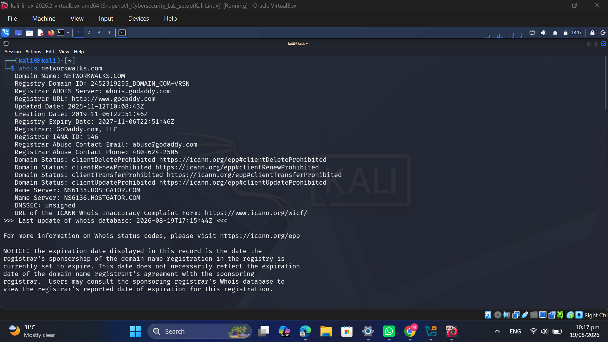
*Figure 1 — whois networkwalks.com showing registrar, dates and HostGator name servers*
 
| What I Found | How Someone Could Abuse It | Risk |
|---|---|---|
| Hosting stack revealed: GoDaddy + HostGator | Once you know the registrar and the DNS/hosting provider, you can start looking for known weaknesses in their control panels, or try a social-engineering call pretending to be the account owner. It also lets you check if other sites share the same name servers, which sometimes exposes a whole cluster of related targets. | 🟢 Low |
| No DNSSEC on the domain | Without DNSSEC there's no cryptographic proof that a DNS answer is genuine. It's not an easy attack to pull off, but it does leave a theoretical door open for spoofing or cache-poisoning between the resolver and whoever's asking. | 🟢 Low |
 
#### 4.1.2  WhatWeb — Web Technology Fingerprinting
 
Next, `whatweb` was pointed at the site to see what it's actually built on.
 
| Field | Detail |
|---|---|
| Command | `whatweb networkwalks.com` |
| Findings | WordPress 7.1, WordPress Download Manager 3.3.58, Bootstrap 7.1, jQuery 3.7.1, Apache, hosted at 192.232.216.135, Google Tag Manager present, page title "Networkwalks Academy" |
| Redirect | HTTP (301) → HTTPS is enforced correctly, so that part's handled well |
 
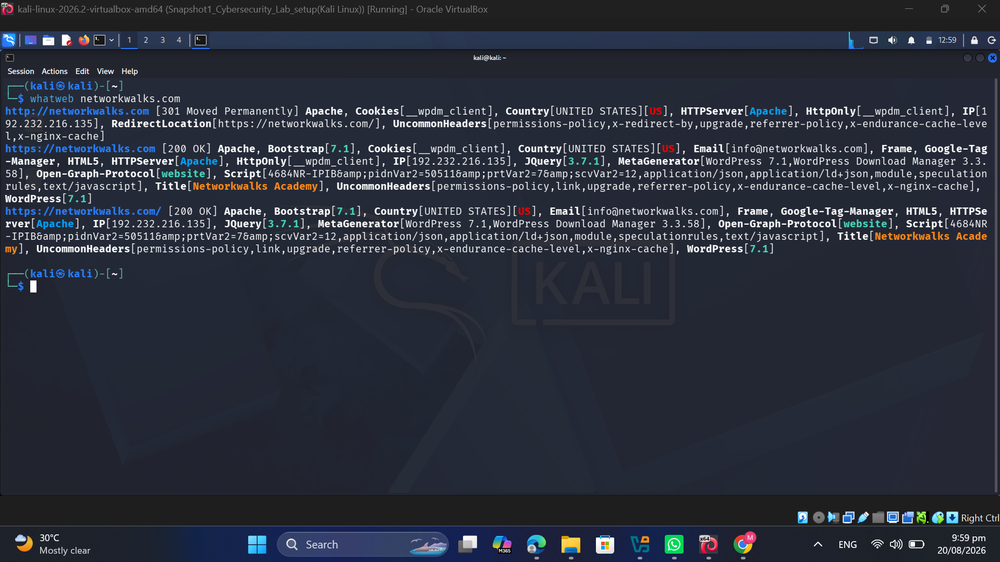
*Figure 2 — whatweb networkwalks.com identifying WordPress 7.1 and WP Download Manager 3.3.58*
 
| What I Found | How Someone Could Abuse It | Risk |
|---|---|---|
| Exact CMS and plugin version numbers exposed | This is the one I'd flag hardest out of the footprinting results. With an exact version like WordPress 7.1 or WPDM 3.3.58, there's no need to guess — you can go straight to WPScan or Exploit-DB, search that version number, and if there's a known unpatched CVE, the recon phase of an actual attack is basically skipped. | 🟠 Medium |
 
#### 4.1.3  Nslookup — DNS Resolution
 
Simple one — just resolving the domain to an IP.
 
| Field | Detail |
|---|---|
| Command | `nslookup networkwalks.com` |
| Result | networkwalks.com resolves to **192.232.216.135** |
 
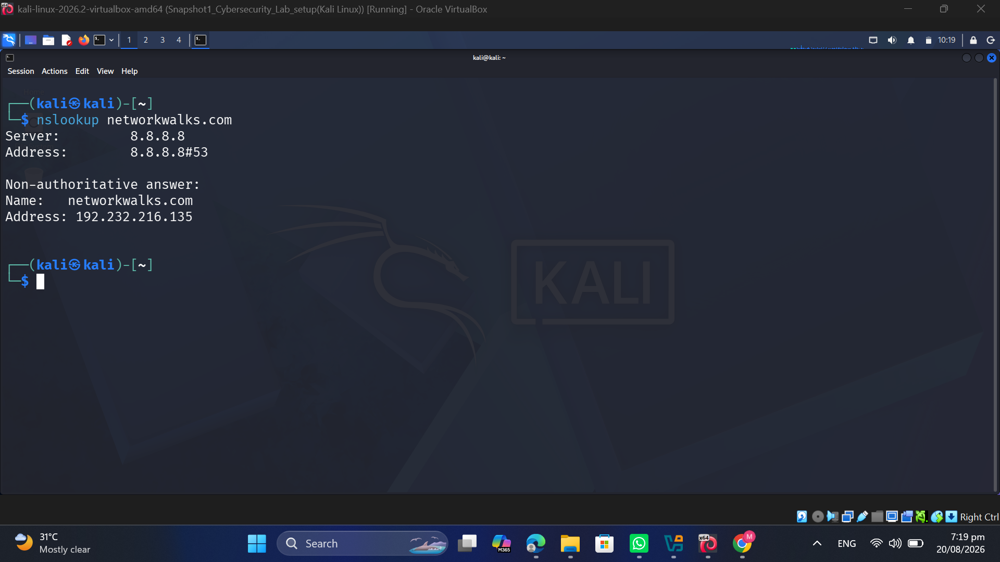
*Figure 3 — nslookup resolving networkwalks.com to 192.232.216.135*
 
| What I Found | How Someone Could Abuse It | Risk |
|---|---|---|
| Origin/hosting IP address now known | If the WAF is only sitting in front of the domain name and the origin server itself still accepts direct connections, an attacker could try hitting 192.232.216.135 straight and skip the WAF entirely. It also opens the door to reverse-IP lookups to see what else is hosted on that same box. | 🟢 Low |
 
#### 4.1.4  curl -I — HTTP Response Headers
 
This one's easy to overlook but usually worth the ten seconds it takes to run — headers leak more than people expect.
 
| Field | Detail |
|---|---|
| Command | `curl -I https://networkwalks.com` |
| Server header | Apache (HTTP/2 200) |
| Notable headers | `x-nginx-cache: WordPress`; link header exposes `/wp-json/` and `/wp-json/wp/v2/pages/53`; `__wpdm_client` cookie confirms WP Download Manager is running; referrer-policy set to "no-referrer-when-downgrade" |
 
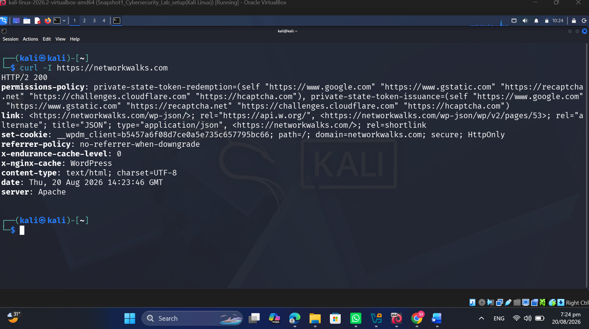
*Figure 4 — curl -I output exposing the server banner and the WordPress REST API link header*
 
| What I Found | How Someone Could Abuse It | Risk |
|---|---|---|
| WordPress REST API endpoint (`/wp-json/`) sitting wide open | The default WP REST API will happily return usernames, author IDs and page structure to anyone who asks — no login needed. That's a ready-made username list for a brute-force or credential-stuffing attempt against real staff accounts. | 🟠 Medium |
| Plugin confirmed a second time via cookie name | The `__wpdm_client` cookie basically double-confirms WP Download Manager is active, which just makes it easier to go straight for known exploits for that specific plugin without extra fingerprinting steps. | 🟢 Low |
 
#### 4.1.5  Wafw00f — WAF Detection
 
Before poking at anything further, it's worth knowing what's actually standing guard in front of the site.
 
| Field | Detail |
|---|---|
| Command | `wafw00f networkwalks.com` |
| Result | Confirmed — the site sits behind **ModSecurity (SpiderLabs)**, identified in just 2 requests |
 
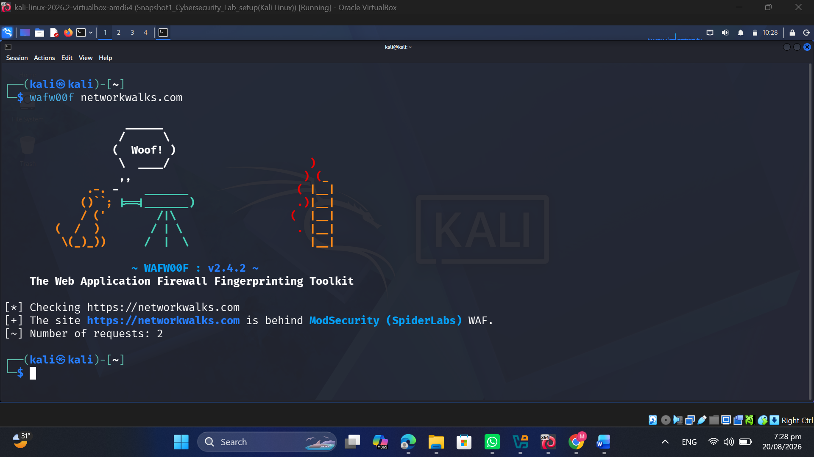
*Figure 5 — wafw00f identifying a ModSecurity (SpiderLabs) WAF in front of networkwalks.com*
 
| What I Found | How Someone Could Abuse It | Risk |
|---|---|---|
| Exact WAF product identified | Good news is there's a WAF at all — plenty of small sites don't bother. But once you know it's specifically ModSecurity, you're no longer fighting an unknown filter; you can go look up documented bypass tricks (encoding quirks, header manipulation, that kind of thing) that are known to work against that exact product. | 🟢 Low |
 
#### 4.1.6  DNSRecon — DNS Enumeration
 
This was the most detailed step of the six, and honestly the one that turned up the most interesting finding of the whole footprinting phase.
 
| Field | Detail |
|---|---|
| Command | `dnsrecon -d networkwalks.com` |
| SOA / NS | ns6135.hostgator.com (50.87.144.87), ns6136.hostgator.com (192.232.216.131) |
| MX / A | mail.networkwalks.com → 192.232.216.135; networkwalks.com → 192.232.216.135 |
| TXT / SPF | google-site-verification present; SPF record reads `v=spf1 +a +mx +ip4:50.87.144.87 +include:websitewelcome.com ~all` |
| SRV | Several `_autodiscover._tcp` records pointing to cpanelemaildiscovery.cpanel.net — confirms cPanel is handling mail autodiscovery |
 
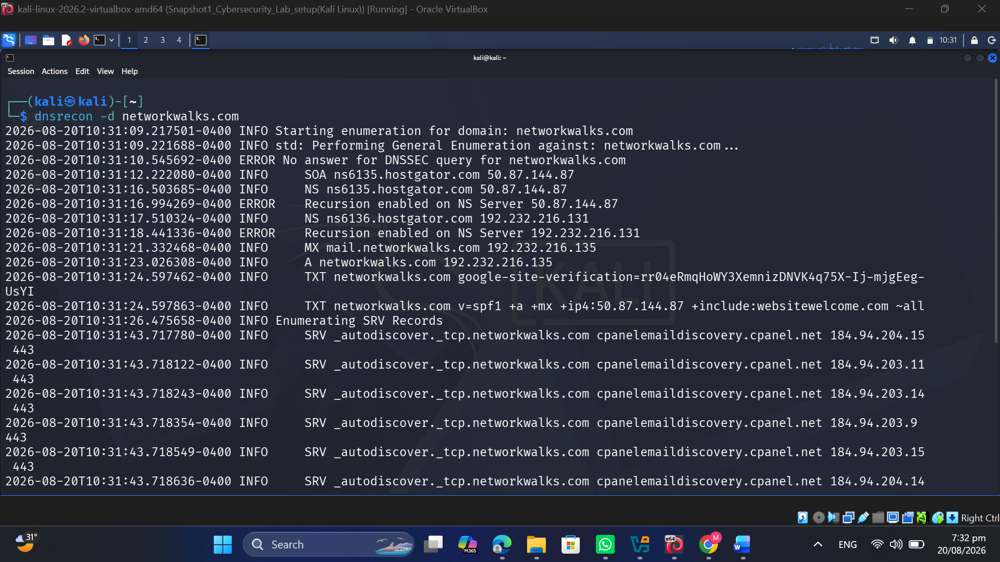
*Figure 6 — dnsrecon output showing NS/MX/TXT/SRV records and recursion enabled on both name servers*
 
| What I Found | How Someone Could Abuse It | Risk |
|---|---|---|
| **Both authoritative name servers have recursion enabled** | This is genuinely the finding I'd raise first if reporting this to the client. An open recursive resolver can be roped into a DNS amplification attack against some completely unrelated third party — the name server ends up doing the attacker's dirty work without the domain owner even realizing it. This isn't something a normal visitor would ever notice; it only shows up because DNSRecon specifically tests for it. | 🟠 Medium |
| Full mail/DNS infrastructure mapped out | Knowing the exact mail platform (cPanel) and the IP ranges allowed to send mail on the domain's behalf (from the SPF record) makes it a lot easier to write a convincing spoofed email, or to spot a gap in the SPF policy that still lets forged mail slide through. | 🟢 Low |
 
---
 
### 4.2 W2-PM4 — theHarvester-Based Footprinting (`microsoft.com`)

--- 
This was the second elective for the week. Instead of running theHarvester against networkwalks.com again, it was pointed at a much bigger domain — microsoft.com — to see how a proper OSINT-harvesting tool performs at scale and how it handles the fact that a lot of its data sources need API keys that weren't configured.
 
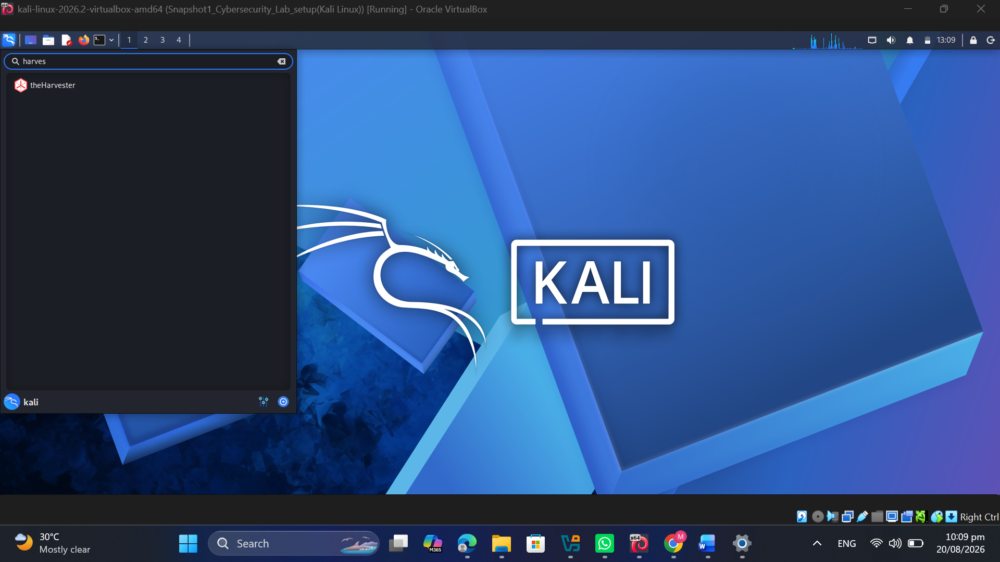
*Figure 7 — Launching theHarvester from the Kali application launcher*
 
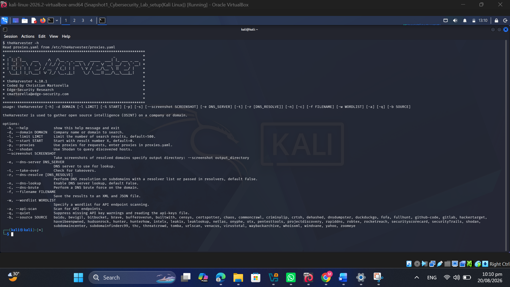
*Figure 8 — theHarvester -h help output listing available flags and OSINT sources*
 
First attempt was against every available source at once. Most of it came back as errors — bevigil, Bitbucket, BuiltWith, Brave Search all refused to run because API keys weren't configured for them. That was a useful lesson on its own: a lot of the more powerful OSINT sources these days are gated behind a paid or free-tier key, they're not just sitting there free for anyone to scrape.
 
**Command:** `theHarvester -d microsoft.com -l 500 -b all`
 
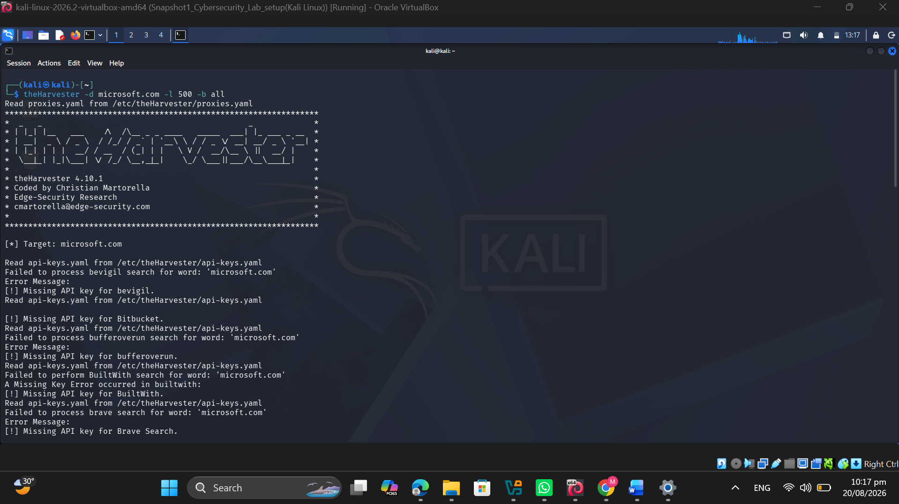
*Figure 9 — theHarvester -b all returning missing-API-key errors for several premium sources*
 
So the scan was narrowed down to just Baidu, which doesn't need a key, and it worked without any issues.
 
| Field | Detail |
|---|---|
| Command | `theHarvester -d microsoft.com -l 1000 -b baidu` |
| Emails found | viva-noreply@microsoft.com |
| Hosts found | account.microsoft.com, microsoftedge.microsoft.com, prod.support.services.microsoft.com, support.microsoft.com, windowsupdate.microsoft.com |
 

*Figure 10 — theHarvester -b baidu returning harvested emails and subdomains for microsoft.com*
 
| What I Found | How Someone Could Abuse It | Risk |
|---|---|---|
| A live email address and 5 subdomains, pulled with zero interaction with the target | This is the part people underestimate about passive OSINT — none of this required touching microsoft.com's servers at all, it's all indexed elsewhere. But that harvested email becomes a phishing target, and each subdomain is a new door to go knock on and fingerprint separately. | 🟠 Medium |
 
---
 
### 4.3 W2-PM5 — Network Scanning with Zenmap
---
 
Second half of the internship task, and a change of pace — instead of poking a public website from the outside, this was about mapping my own local network from the inside using Zenmap.
 
| Field | Detail |
|---|---|
| Command | `ipconfig` |
| Result | Ethernet adapter 4 (VirtualBox Host-Only Network): IPv4 Address 192.168.56.1, Subnet Mask 255.255.255.0 |
 
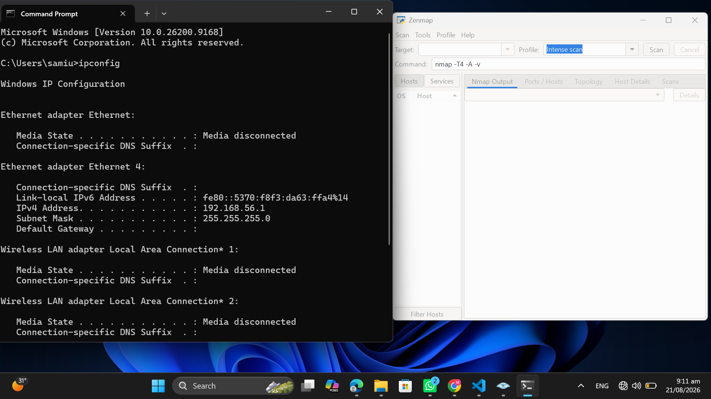
*Figure 11 — ipconfig identifying the local IPv4 address 192.168.56.1/24 on the VirtualBox host-only adapter*
 
With the subnet confirmed as 192.168.56.0/24, it was loaded into Zenmap and the Ping Scan profile was run — this just checks who's alive, it doesn't touch any ports yet.
 
**Command:** `nmap -sn 192.168.56.0/24`
 
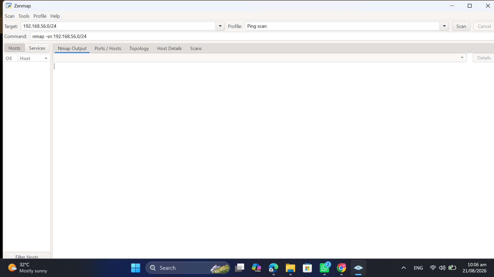
*Figure 12 — Zenmap configured with target 192.168.56.0/24 and the Ping Scan profile*
 
**Result:** Only 1 live host — 192.168.56.1, which is the host machine itself. 256 addresses checked in 11.69 seconds, nothing else answered.
 
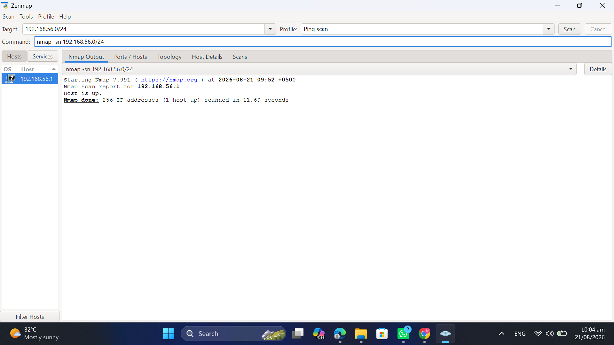
*Figure 13 — Ping scan result: 192.168.56.1 is up, 1 of 256 addresses responding*
 
The Topology tab was then opened, the legend turned on, to review the graphic Zenmap generated — a bit anticlimactic with just one host, but it did exactly what it was supposed to.
 
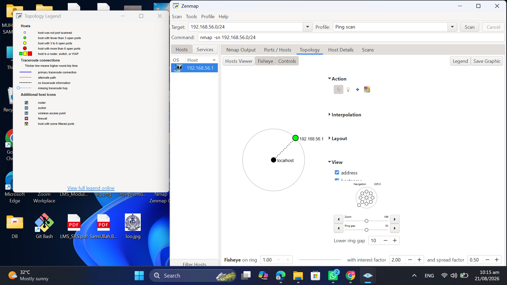
*Figure 14 — Zenmap Topology view with legend enabled, showing 192.168.56.1 linked to localhost*
 
Worth being upfront about this: because an isolated VirtualBox host-only adapter was scanned and not an actual home or office LAN, there was never going to be more than one device to find. On a real, populated network — routers, phones, laptops, smart TVs, whatever else is connected — this exact same ping sweep would come back with a whole list of live hosts, each with their own IP and MAC address.
 
| What I Found | How Someone Could Abuse It | Risk |
|---|---|---|
| Live hosts discoverable with a basic ping sweep | This is step one of pretty much any internal attack or insider threat scenario. Once you can see what's alive on a network, the natural next move is port-scanning each host and looking for services worth attacking. On a lab segment like this that's a non-issue, but on a real production LAN it's exactly how someone starts mapping out lateral movement paths. | 🟡 Low–Medium |
 
---
 
## 5. Consolidated Findings, Risk Level & Recommendations
 
Pulling everything from Section 4 together in one place — every finding from W2-PM1 (the six footprinting tools), W2-PM4 (theHarvester), and W2-PM5 (the Zenmap network scan) — alongside a risk rating and the corresponding recommendation.
 
| # | Finding | Risk Level | Recommendation |
|---|---|---|---|
| 1 | CMS & plugin versions disclosed (WordPress 7.1, WPDM 3.3.58) | 🟠 Medium | Keep WordPress core, WP Download Manager, Bootstrap and jQuery on a regular patch cycle and check them against current CVE advisories. |
| 2 | WordPress REST API endpoint exposed (`/wp-json/`) | 🟠 Medium | Lock down or authenticate the sensitive `/wp-json/` routes, and turn off user-enumeration endpoints the site doesn't actually need. |
| 3 | Origin/hosting IP address identifiable (192.232.216.135) | 🟢 Low | Make sure the WAF/CDN also filters traffic hitting the IP directly, or firewall the origin so it only accepts connections coming from the WAF. |
| 4 | DNS recursion enabled on both authoritative name servers | 🟠 Medium | Disable open recursive queries on ns6135/ns6136.hostgator.com for anyone outside the intended zone — this closes the amplification risk. |
| 5 | Mail/DNS infrastructure enumerated (MX, SPF, SRV / cPanel autodiscover) | 🟢 Low | Give MX, SPF, TXT and SRV records a periodic review and remove anything that isn't actually being used anymore. |
| 6 | WAF product identifiable (ModSecurity / SpiderLabs) | 🟢 Low | Keep ModSecurity switched on, patched and properly tuned — it's already doing its job against casual attacks, so don't let it go stale. |
| 7 | Public email & subdomains harvestable via OSINT (theHarvester) | 🟠 Medium | Treat anything harvestable as part of the phishing surface — keep an eye on what's publicly exposed and retire addresses that don't need to be public. |
| 8 | Local network hosts discoverable via ping sweep (Zenmap) | 🟡 Low–Medium | Run authorized internal network discovery on a regular schedule so unexpected or unauthorized devices get noticed quickly. |
 
**Risk key:** 🔴 Critical &nbsp; 🟠 Medium &nbsp; 🟢 Low &nbsp; 🟡 Low–Medium
 
> One caveat worth being clear about: everything above is an observation from footprinting, OSINT and host-discovery work — not a confirmed vulnerability. Nothing was exploited, and no attempt was made to validate that these issues are actually exploitable, because that wasn't in scope for these modules. Finding an exposed version number or an open recursive resolver doesn't automatically mean the target is breakable — it just means it's worth someone taking a closer, authorized look.
 
---
 
## 6. Conclusion
 
Looking back at Week 2, this was really about building the muscle memory for how a real engagement starts — not with an exploit, but with patience and a checklist of boring-sounding tools that add up to a surprisingly complete picture of a target.
 
On the footprinting side, working through networkwalks.com with WHOIS, WhatWeb, Nslookup, curl, Wafw00f and DNSRecon showed just how much is sitting out in the open for anyone who bothers to look — hosting details, exact plugin versions, a live WAF fingerprint, and, in DNSRecon's case, an actual misconfiguration (recursion enabled) that wouldn't have shown up from casually browsing the site.
 
W2-PM4, running theHarvester against microsoft.com, was a good reality check on its own — it drove home that a lot of modern OSINT tooling is gated behind API keys, and that even the free sources can still return usable results like live emails and subdomains without ever touching the target directly.
 
W2-PM5, the Zenmap module, was more about the workflow than the results — the lab network only had one host to find, but the process (identify the subnet, ping-sweep it, review the topology) is exactly what would scale up to a real, busier network.
 
If there's one takeaway to hold onto from this week, it's that reconnaissance alone — no exploitation, nothing destructive — already tells you a lot about how exposed an organization is. And just as importantly, every bit of this stayed inside an authorized scope: networkwalks.com with permission on file, and a lab network owned outright.
 
---
 
## 7. Evidence Collected
 
All the raw command output is embedded directly in Section 4, right next to the step it belongs to (Figures 1–14), rather than dumped separately at the end — it made more sense to keep the evidence next to the context. Every screenshot was captured straight from the Kali terminal (for the footprinting and theHarvester work) or from Zenmap / Windows Command Prompt (for the network scan), and none of them have been edited or cropped beyond what was needed to fit the page.
 
---
 
## ⚖️ Scope & Permission
 
All activity in this repository was carried out against:
1. `networkwalks.com` — **written permission secured** in advance, and
2. My own local VirtualBox host-only network — a system I own and control.
No unauthorized systems were tested. This work is for educational purposes as part of an internship program and should not be replicated against any target without explicit written authorization.
 
---
 
## 👤 Author
 
**Muhammad Ahsan** — Cybersecurity Professional, B083
 
🔗 LinkedIn: [linkedin.com/in/mahsan-mushtaq/](https://www.linkedin.com/in/mahsan-mushtaq/)
 
**Project Information:** Program: Cybersecurity Program at Networkwalks &nbsp;|&nbsp; Week: 02
